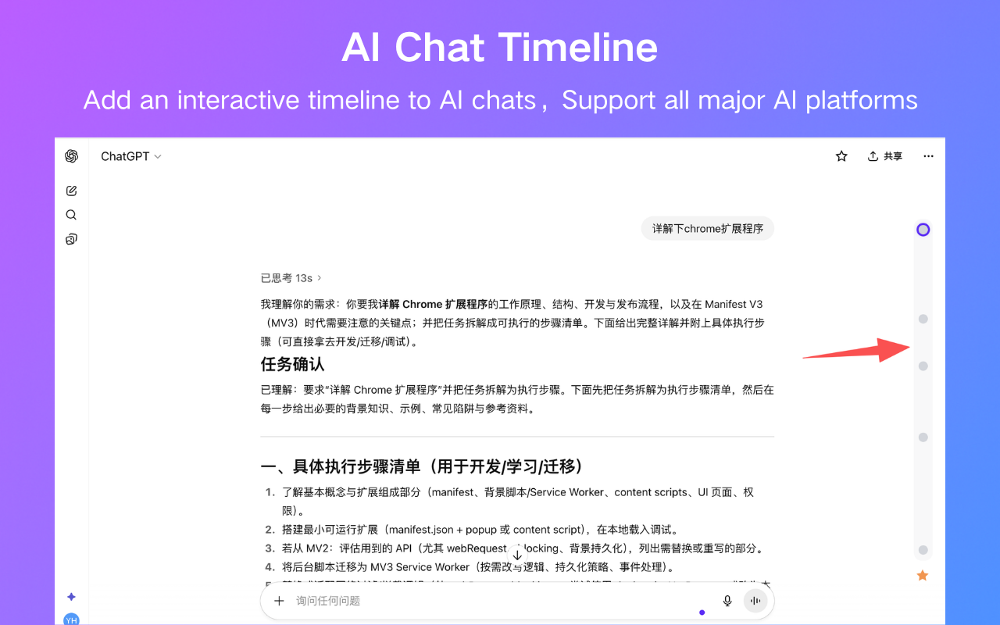

  <h1>AI Chat Timeline</h1>
  
Add timeline to AI conversations, compatible with all mainstream AI platforms
  
  

    <a href="./README.md">🇨🇳 点击此处查看中文版</a>
  

---

  

---

## 🌟 Features

- **Visual Timeline**: Adds an intuitive vertical timeline to AI chat interfaces
- **Quick Navigation**: Click on timeline dots to instantly jump to any question in the conversation
- **Smart Bookmarking**: Star important questions and answers for easy access later
- **Active State Tracking**: Automatically highlights the current position in the conversation
- **Multi-Platform Support**: Works with all mainstream AI platforms
- **Internationalization**: Supports English and Simplified Chinese

## ✅ Installation

### Method 1: Chrome Web Store (Highly Recommended)

1. Visit the [Chrome Web Store](https://chromewebstore.google.com/detail/ai-chat-timeline-ai-chat/fgebdnlceacaiaeikopldglhffljjlhh)
2. Click "Add to Chrome"
3. Open any AI chat platform and start a conversation

### Method 2: Manual Installation

1. **Download** - Click to download [AIChatTimeline-v1.1.0.zip](./AIChatTimeline-v1.1.0.zip)
2. **Extract** - Unzip the downloaded file
3. **Open Extensions Page** - Navigate to `chrome://extensions/`
4. **Enable Developer Mode** - Toggle it on in the top right corner
5. **Load Extension** - Click "Load unpacked" and select the extracted folder
6. **Start Using** - Open any AI chat platform and start a conversation

## 🚀 Supported Platforms

<table>
  <tr>
    <td align="center">✅ ChatGPT</td>
    <td align="center">✅ Gemini</td>
    <td align="center">✅ Doubao</td>
    <td align="center">✅ DeepSeek</td>
  </tr>
  <tr>
    <td align="center">✅ Baidu Yiyan</td>
    <td align="center">✅ Alibaba Tongyi</td>
    <td align="center">✅ Kimi</td>
    <td align="center">✅ Tencent Yuanbao</td>
  </tr>
</table>

## 🚧 Planned Features

- [ ] Add support for Claude AI
- [ ] Add support for Copilot
- [ ] Support starring entire chat page
- [ ] Support starring AI responses
- [ ] Support adding notes after starring
- [ ] Support Firefox, Edge, and other browsers

---

## 📋 Changelog

### Version 1.1.0 2025-10-13

- Support viewing starred list
- Support quick copy of chat questions
- Fixed known bugs and optimized interaction experience

### Version 1.0.0 2025-10-10

- Support cross-AI platform starring
- Project initialization

---

## 📄 License

This project is licensed under the [MIT License](./LICENSE)

---

## 💬 Contact & Support

- **Issue Tracker**: [GitHub Issues](../../issues)
- **Email**: houyanchao@outlook.com

---

## 🙏 Acknowledgements

This project is developed based on the initial code from [chatgpt-conversation-timeline](https://github.com/Reborn14/chatgpt-conversation-timeline). We sincerely appreciate the original author's open-source contribution. Building upon this foundation, we have optimized the interaction and enhanced features, adapted it for all mainstream AI platforms, and added cross-platform conversation starring support.

---

  
⭐ If you find this extension useful, please consider giving it a star on GitHub!

