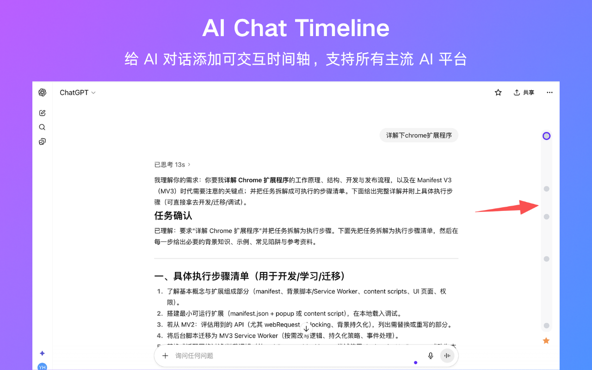

  <h1>AI Chat Timeline - AI 对话时间轴</h1>
  
给 AI 对话添加时间轴，兼容所有主流 AI 平台
  
  

    <a href="./README.en.md">🇺🇸 Click here for the English README</a>
  

---

  

---

## 🌟 功能特性

- **可视化时间轴**：为 AI 对话界面添加直观的垂直时间轴
- **快速导航**：点击时间轴节点，即可快速跳转到任意提问位置
- **智能收藏**：收藏重要的问题和回答，方便后续查看
- **智能激活状态**：自动高亮显示当前在对话中的位置
- **多平台支持**：支持所有主流 AI 平台
- **国际化支持**：支持英文和简体中文

## ✅ 安装方式

### 方式一：应用商店（强烈推荐）

1. 点击访问 [Chrome 应用商店](https://chromewebstore.google.com/detail/ai-chat-timeline-ai-chat/fgebdnlceacaiaeikopldglhffljjlhh)
2. 点击"添加至 Chrome"
3. 打开任意 AI 对话平台，开始对话即可

### 方式二：手动安装

1. **下载** - 点击下载 [AIChatTimeline-v1.1.0.zip](./AIChatTimeline-v1.1.0.zip)
2. **解压** - 解压下载的 ZIP 文件
3. **打开扩展页面** - 访问 `chrome://extensions/`
4. **开启开发者模式** - 在页面右上角开启
5. **加载扩展** - 点击"加载已解压的扩展程序"，选择解压后的文件夹
6. **开始使用** - 打开任意 AI 对话平台，开始对话即可

## 🚀 支持的平台

<table>
  <tr>
    <td align="center">✅ ChatGPT</td>
    <td align="center">✅ Gemini</td>
    <td align="center">✅ 豆包</td>
    <td align="center">✅ DeepSeek</td>
  </tr>
  <tr>
    <td align="center">✅ 文心一言</td>
    <td align="center">✅ 通义千问</td>
    <td align="center">✅ Kimi</td>
    <td align="center">✅ 腾讯元宝</td>
  </tr>
</table>

## 🚧 开发计划

- [ ] 适配 Claude AI
- [ ] 适配 Copilot
- [ ] 支持收藏整页聊天
- [ ] 支持收藏AI的回复
- [ ] 支持收藏后添加备注
- [ ] 支持 Firefox、Edge 等浏览器

---

## 📋 更新日志

### Version 1.1.0 2025-10-13

- 支持查看收藏列表
- 支持快速复制聊天问题
- 修复已知bug，优化交互体验

### Version 1.0.0 2025-10-10

- 支持跨 AI 平台的收藏
- 项目初始化

---

## 📄 许可证

本项目采用 [MIT License](./LICENSE) 开源协议

---

## 💬 联系与支持

- **问题反馈**：[GitHub Issues](../../issues)
- **邮件联系**：houyanchao@outlook.com

---

## 🙏 致谢

本项目基于 [chatgpt-conversation-timeline](https://github.com/Reborn14/chatgpt-conversation-timeline) 的初始代码进行开发，感谢原作者的开源贡献。在此基础上进行交互优化和功能增强，适配所有主流 AI 平台，支持跨平台的对话收藏。

---

  
⭐ 如果这个扩展对你有帮助，欢迎给项目点个 Star！

